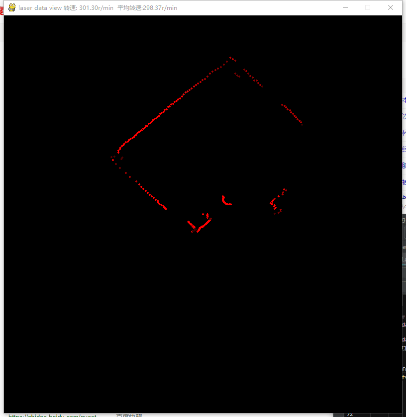
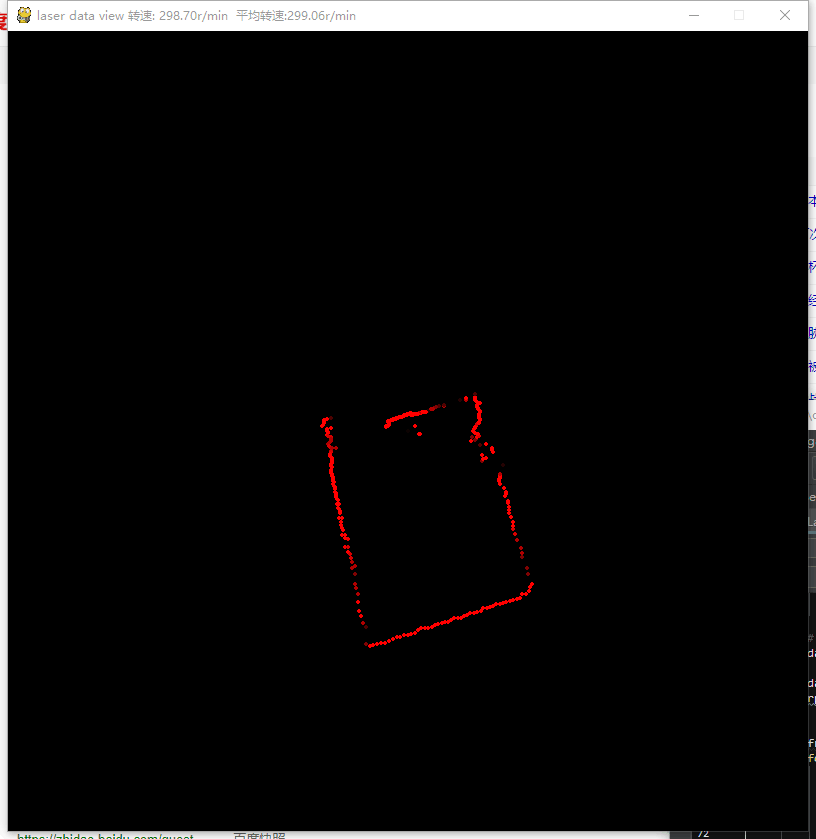

激光雷达hls_flcd2的python调试工具。可进行串口调试，数据包解析，使用pygame绘制可视化点云数据

## 依赖
- pygame
- serial

## 环境
- win/linux
- 串口默认com3 ,需要自行修改
- python3.4.5

## 项目目录
- Laser.py 激光雷达对象，提供 start stop read_data方法
- main.py  命令行测试获取数据
- ui/window.py  界面展示点云数据

## ROS平台 非python

- 参考 <a href="http://javabin.cn/2018/hls_flcd2.html">调试使用HLS-LFCD2激光雷达</a>

## view

